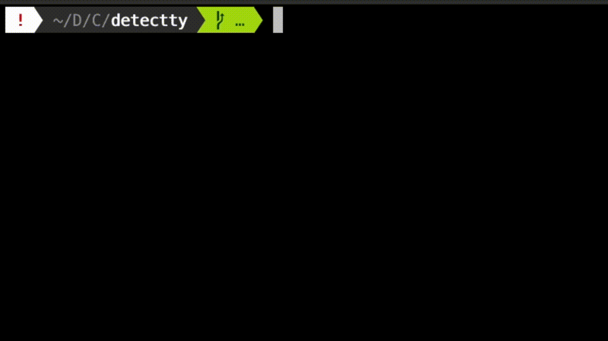

# detectty

Detect freshly plugged `tty` devices.

# Usage

1. Make sure your device is unplugged.
2. Call `./detectty.py`.
3. Plug in your device.
4. You device will show up.

# Requirements

- Python3

# Supported Platforms

- Linux
- macOS
